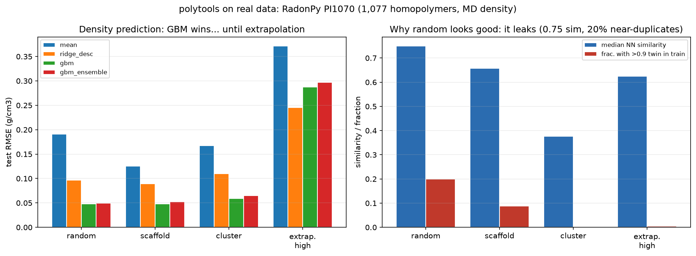
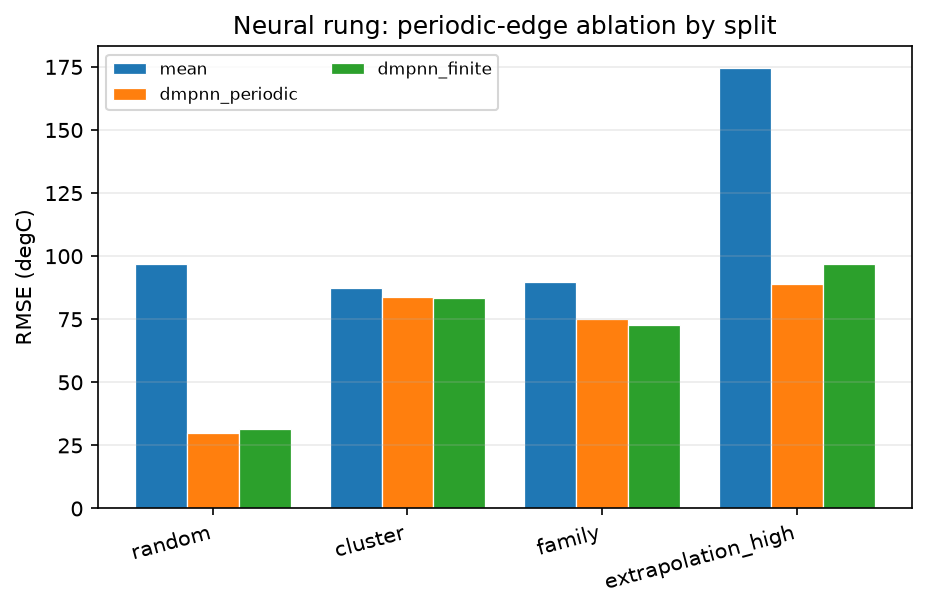
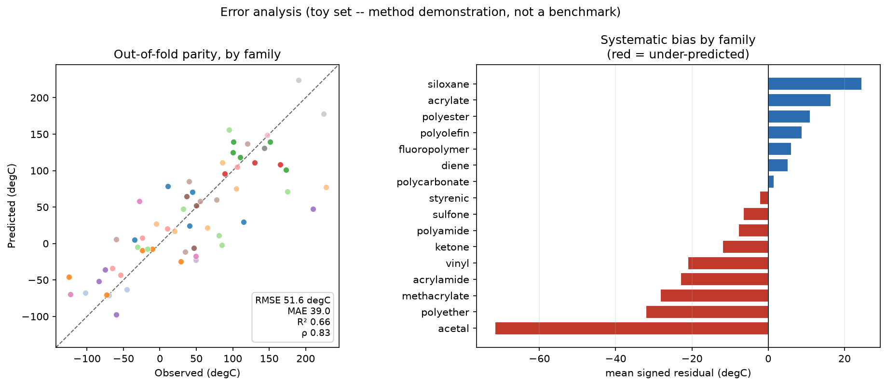

# polytools

**Honest machine-learning infrastructure for polymer property prediction.**


&nbsp;·&nbsp; MIT &nbsp;·&nbsp; Python 3.10–3.12

Off-the-shelf cheminformatics assumes a discrete molecule; a polymer is a
statistical ensemble, so the standard tools run without error and return numbers
that are quietly wrong. `polytools` fixes the polymer-specific parts — repeat-unit
featurization, structured out-of-distribution splits, calibrated uncertainty — and
pairs them with a model ladder from a linear baseline to a graph neural network, so
a property-prediction result can actually be *trusted*.

## The result that matters

The point of the library, on real data — **RadonPy PI1070**, 1,077 homopolymers,
predicting density (BSD-3-Clause, [reproduce below](#run-it)):



| split | gradient-boosting R² | RMSE (g/cm³) | how similar is test to train? |
|:---|---:|---:|---:|
| **random** | 0.94 | 0.048 | 0.75 median — **20% near-duplicates** |
| cluster (structured) | 0.88 | 0.059 | 0.38 median |
| **extrapolation** (high density) | **−2.36** | 0.288 | 0.62 median |

A random split looks superb (R² 0.94) — but its test set is **0.75-similar to
training with 20% near-duplicates**, so the model is being graded on chemistry it
has effectively already seen. On the extrapolation split, asked for polymers denser
than anything in training, gradient boosting scores **R² = −2.36 — worse than
predicting the mean.** A single random-split number would have hidden a model that
fails exactly where a materials scientist needs it. Measuring that gap — instead of
hiding it — is what the library is for.

## Run it

```bash
git clone https://github.com/DrGregPitch/polytools && cd polytools
uv venv && uv pip install -e ".[all]"

python scripts/fetch_data.py radonpy                                   # real data, on demand (BSD-3)
python scripts/run_benchmark.py --data data_cache/PI1070.csv \
    --psmiles-col smiles --target-col density --units g/cm3 --outdir results
```

That regenerates every number above in ~2 minutes on CPU (the composed headline figure is assembled separately). Drop the
`--data` flag to run on the bundled 60-polymer toy set instead; point it at any
polymer CSV to run on yours. `pytest tests -v` runs 51 tests (57 with the `.[gnn]`
neural-net extra).

## What's inside

- **Structured splits that don't flatter the model** — random, leave-a-family-out,
  scaffold, Butina-cluster, property-extrapolation — plus `split_difficulty()`,
  which *measures* how out-of-distribution a split really is instead of asserting
  it.
- **A model ladder, every rung reported** — mean → ridge → gradient boosting → a
  **directed message-passing GNN** (chemprop-style, PyTorch), all behind one
  `fit`/`predict` interface. When the GNN loses to gradient boosting on a split, the
  README says so.
- **Calibrated uncertainty** — deep ensembles / MC-dropout, recalibrated on
  validation, with reliability diagrams and a selective-prediction curve.
- **Polymer-aware featurization** — a repeat unit (`[*]CC([*])c1ccccc1`) is turned
  into a well-defined finite molecule three ways (cap / oligomer / cyclize), with
  extensive descriptors normalized per repeat unit.
- **A mechanistic error analysis** — *which* chemistries fail and *why*, with
  structures shown. [See below.](#error-analysis-where-it-fails-and-why-a-chemist-can-tell)
- **A clickable demo** — paste a repeat unit → Tg with a calibrated error bar and an
  applicability-domain check ([`demo/`](demo/)).

---

## Why polymers break the standard tools

A repeat unit is written as a *pSMILES* — an ordinary SMILES with two dummy atoms
(`[*]`) marking where the chain continues. Those dummies are notation, not
chemistry, and they quietly corrupt everything computed on them: descriptors count
the cut point, fingerprints hash the chemist's arbitrary framing, scaffolds mangle.
`polytools` converts a repeat unit into an honest finite molecule *before* any
cheminformatics runs — the one decision the whole library routes through:

```python
from polytools import prepare_mol
from rdkit import Chem
Chem.MolToSmiles(prepare_mol("[*][Si](C)(C)O[*]", mode="cyclize"))   # a real cyclosiloxane, no fake end groups
```

## Honest splits, illustrated

The same lesson on a controlled 60-polymer set (Tg, °C) makes the mechanism obvious
— same model, same features, **only the split changes**:

| model | random | family | cluster | scaffold | extrapolation |
|:---|---:|---:|---:|---:|---:|
| mean baseline | 97.0 | 89.6 | 87.2 | 124.0 | 174.4 |
| **gradient boosting** | **48.1** | 55.6 | 57.9 | **126.3** | 133.1 |

Gradient boosting halves the error on a random split and is **worse than the mean
predictor on a scaffold split**. (Toy numbers, for demonstration — the reportable
version is the real-data table up top.)

## The neural rung: a polymer-aware D-MPNN

`gnn.py` puts a directed message-passing network on the graph representation in
`graphs.py`, which drops the dummy atoms as nodes and adds a **periodic edge**
wrapping the repeat unit into a chain — so the model sees a polymer, not a molecule
with two fake ends. The clean experiment that falls out — periodic edge on vs off —
shows it **helps most on extrapolation**, exactly where chain-continuity should
matter, and the GNN and gradient boosting **trade wins across splits** (reported,
not hidden). This ablation runs on the 60-polymer demonstration set (≈12 test
points per split, single seed), so read it as directional, not a benchmark result.
PyTorch is an optional `.[gnn]` extra, imported lazily.



## Error analysis: where it fails, and why a chemist can tell

`scripts/error_analysis.py` computes an out-of-fold residual for every polymer and
finds where the errors concentrate (on the 60-polymer demonstration set). **The model shrinks toward the mean** — it
under-predicts high-Tg families (rigid backbones, cooperative H-bonding) and
over-predicts low-Tg ones (flexible siloxanes) — because both drivers are invisible
to a *local* fingerprint. The single biggest miss, poly(2,6-dimethyl-1,4-phenylene
oxide), is off by 163 °C: a rigid backbone the fingerprint reads as "just an
aromatic ether." No single descriptor predicts the error (all |ρ| < 0.15) — the
failures are structural, which is the argument for a chain-aware representation.



## Calibrated uncertainty

An ensemble hands you a σ; it means nothing until 80% intervals contain the truth
80% of the time. `SigmaRecalibrator` fixes the systematic overconfidence with one
scalar fit on validation, and three diagnostics keep it honest —
`miscalibration_area` (right size?), `error_uncertainty_correlation` (does σ rank
the wrong ones?), and `selective_prediction_curve` (if I act on the confident 30%,
what error?).

## Real data, and the hardening it forced

`fetch_data.py` downloads a permissively-licensed real dataset on demand (no data is
committed to the repo); `describe_real_datasets()` lists sources by verified
license. Real data is also a fuzzer: ~5% of PI1070 (fused-ring polyimides) crash
kekulization when capped or oligomerized but cyclize cleanly, so `prepare_mol` now
falls back through modes rather than silently dropping a whole chemical class.
(PI1070's labels are MD-computed, not experimental — labelled as such; the pipeline
is identical for an experimental set.)

## Part of a three-project portfolio

- **polytools** (this repo) — the honest-evaluation harness and property models.
- [**copolybench**](https://github.com/DrGregPitch/copolybench) — when does copolymer
  *sequence* matter? A controlled representation benchmark built on this harness.
- [**formulate**](https://github.com/DrGregPitch/formulate) — active learning for
  formulation, using these models as its surrogate.

## Limitations

Repeat-unit structure alone omits molecular-weight distribution, tacticity, and
crystallinity — each worth tens of degrees of Tg — so there is a hard error floor no
featurizer defeats. Scaffold splits are weak for polymers (many repeat units are
acyclic); prefer cluster or family splits. Small-data neural uncertainty is poorly
calibrated even after recalibration, and the reliability diagram says so.

## License

MIT
